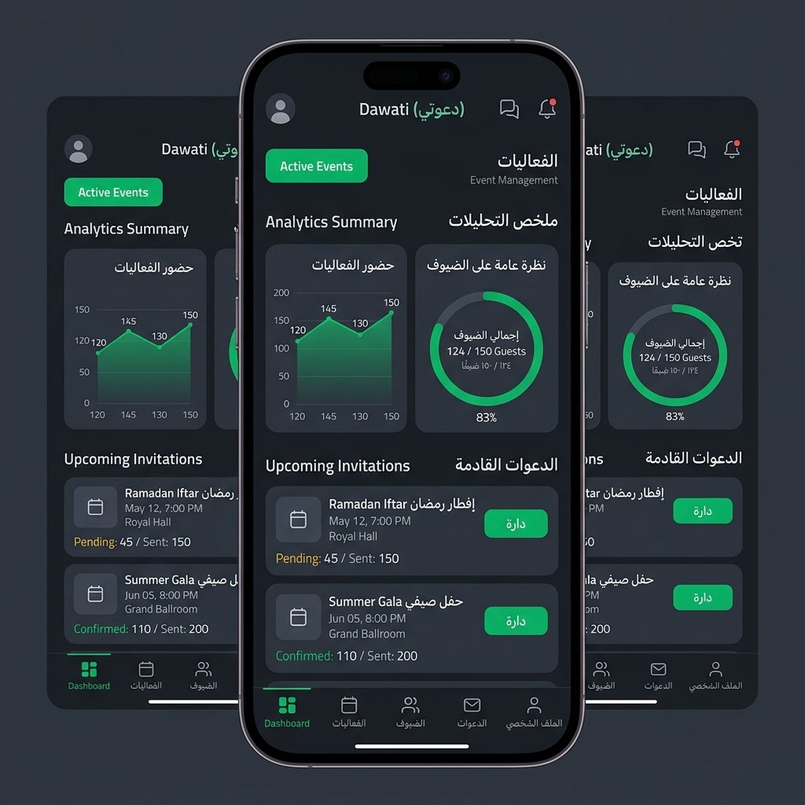
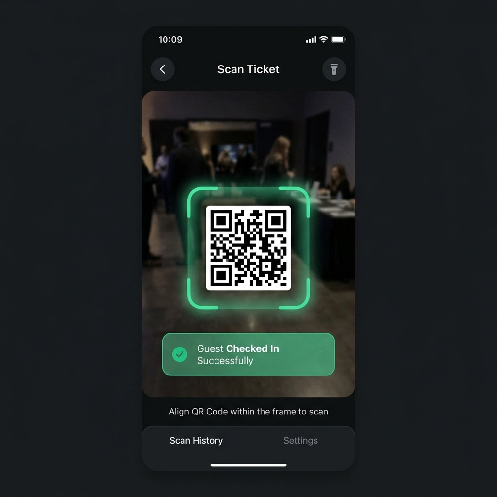

<div align="center">

# دعواتي — Dawati 🎉
### نظام الدعوات الرقمية الذكي | Smart Digital Invitation System

[](https://flutter.dev)
[](https://supabase.com)
[](https://dart.dev)
[](LICENSE)

<br>

> **دعواتي** منصة متكاملة لإدارة المناسبات والدعوات الرقمية — من إنشاء الدعوة وتوزيعها، إلى تسجيل حضور الضيوف بكود QR في الوقت الفعلي.

</div>

---

## 📱 لقطات الشاشة | Screenshots

<p align="center">
  
  
  
</p>

---

## ✨ المميزات الرئيسية | Features

### 👤 للمنظمين (Organizers)
- 🎪 **إنشاء المناسبات** — إعداد الفعاليات بالتاريخ والموقع والتفاصيل الكاملة
- 🎨 **دعوات رقمية فاخرة** — قوالب متعددة بتصاميم احترافية (ملكي، ليلي، ربيعي...)
- 👥 **إدارة الضيوف** — إضافة الضيوف فردياً أو استيراد جماعي من CSV وجهات الاتصال
- 📲 **مشاركة عبر واتساب** — إرسال الدعوات تلقائياً مع رمز QR لكل ضيف
- 📊 **تحليلات حية (Realtime)** — متابعة الحضور والإحصائيات لحظة بلحظة
- 👔 **إدارة الموظفين** — تعيين فريق الاستقبال لكل مناسبة
- 💎 **نظام الباقات** — خطة مجانية واحترافية بحدود مرنة قابلة للتخصيص

### 🔍 للموظفين (Staff)
- 📷 **ماسح QR متقدم** — تسجيل دخول الضيوف بمسح سريع مع صوت تأكيد
- ✅ **التحقق الفوري** — عرض بيانات الضيف ومنع الدخول المكرر
- 🚪 **إدارة البوابات** — تتبع كل بوابة دخول بشكل مستقل

### 🛡️ للمدراء (Admins)
- 🏢 **لوحة إدارة النظام** — إدارة جميع المنظمين والاشتراكات
- 📋 **سجلات المراقبة** — Audit Logs لجميع العمليات الحساسة
- ⚙️ **تخصيص الباقات** — رفع أو خفض حدود كل منظم بشكل مستقل

---

## 🛠️ التقنيات المستخدمة | Tech Stack

| التقنية | الاستخدام |
|---|---|
| **Flutter** | تطوير تطبيق Android (Cross-platform ready) |
| **Dart** | لغة البرمجة الأساسية |
| **Supabase** | قاعدة البيانات + المصادقة + Realtime + Storage |
| **PostgreSQL** | قاعدة البيانات العلائقية عبر Supabase |
| **Riverpod** | إدارة الحالة (State Management) |
| **Go Router** | التنقل بين الشاشات (Navigation) |
| **Google Fonts** | خط القاهرة العربي الجميل |
| **Flutter Animate** | تأثيرات حركية سلسة |
| **Mobile Scanner** | مسح رموز QR |
| **QR Flutter** | توليد رموز QR |
| **FL Chart** | رسوم بيانية تفاعلية |

---

## 🏗️ هيكل المشروع | Project Structure

```
lib/
├── core/
│   ├── errors/          # معالجة الأخطاء
│   ├── theme/           # نظام التصميم والألوان
│   ├── utils/           # أدوات مساعدة
│   └── widgets/         # مكونات مشتركة
├── features/
│   ├── auth/            # تسجيل الدخول والمصادقة
│   ├── events/          # إدارة المناسبات
│   ├── guests/          # إدارة الضيوف
│   ├── invitation/      # قوالب الدعوات الرقمية
│   ├── scanner/         # ماسح QR
│   ├── analytics/       # التحليلات والإحصائيات
│   ├── admin/           # لوحة إدارة النظام
│   └── settings/        # الإعدادات
└── main.dart
```

---

## 🚀 تشغيل المشروع | Getting Started

### المتطلبات | Prerequisites
- Flutter SDK `>=3.0.0`
- Dart SDK `>=3.0.0`
- حساب Supabase (مجاني)
- Android Studio أو VS Code

### خطوات التشغيل | Installation

```bash
# 1. استنساخ المشروع
git clone https://github.com/ShakeebDev/dawati.git
cd dawati

# 2. تثبيت الحزم
flutter pub get

# 3. إعداد Supabase
# أنشئ ملف lib/core/config/supabase_config.dart وضع فيه:
# const supabaseUrl = 'YOUR_SUPABASE_URL';
# const supabaseAnonKey = 'YOUR_ANON_KEY';

# 4. تشغيل التطبيق
flutter run
```

### إعداد قاعدة البيانات | Database Setup
نفّذ ملفات SQL الموجودة في جذر المشروع بالترتيب:
1. `supabase_security_schema.sql` — الجداول والسياسات الأمنية
2. `fix_subscription_limits.sql` — نظام الاشتراكات والحدود
3. `fix_event_staff.sql` — إدارة موظفي المناسبات

---

## 🔐 نظام الأدوار | Role System

```
Admin (مدير النظام)
  └── Organizer (المنظم)
        └── Staff (موظف الاستقبال)
              └── Guest (الضيف — QR فقط)
```

---

## 📦 الباقات | Subscription Plans

| الميزة | مجاني Free | احترافي Pro |
|---|:---:|:---:|
| عدد المناسبات | 1 | غير محدود |
| الضيوف لكل مناسبة | 50 | غير محدود |
| الموظفون | ❌ | ✅ |
| التحليلات المتقدمة | محدودة | كاملة |
| قوالب الدعوات | أساسية | جميع القوالب |

---

## 👨‍💻 المطور | Developer

**Shakib Saeed Mohammed Ghaleb**

[](https://github.com/ShakeebDev)
[](mailto:shkybalhashmy@gmail.com)
[](https://wa.me/967738180731)

---

## 📄 الترخيص | License

هذا المشروع مرخص تحت رخصة MIT — راجع ملف [LICENSE](LICENSE) للتفاصيل.

---

<div align="center">
صُنع بـ ❤️ في اليمن 🇾🇪
</div>
